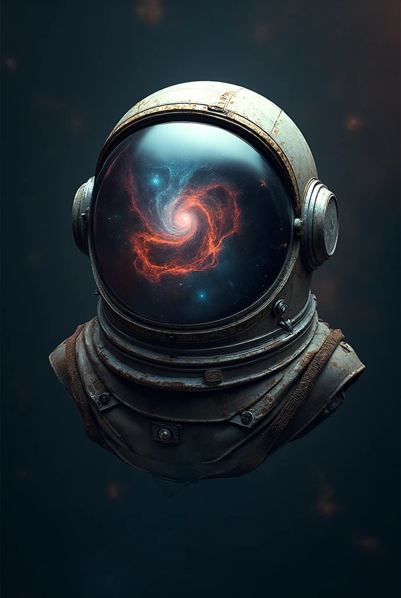

# Podcast "Poeira das Estrelas" | Desafio de Projeto DIO


> Projeto de criação de um podcast utilizando um fluxo de trabalho 100% baseado em Inteligência Artificial Generativa, como parte do desafio da [Digital Innovation One (DIO)](https://www.dio.me/).

---

### 📖 Índice

* [Sobre o Projeto](#-sobre-o-projeto)
* [🎬 Resultado Final](#-resultado-final)
* [🤖 Prompts Utilizados](#-prompts-utilizados)
* [🛠️ Ferramentas](#️-ferramentas)
* [👨‍💻 Autor](#-autor)

---

## 📝 Sobre o Projeto

**Poeira das Estrelas** é um podcast para leigos e curiosos sobre a história da exploração espacial. Este projeto demonstra a criação de um episódio piloto do zero, onde cada componente — roteiro, narração e identidade visual — foi gerado por uma ferramenta de IA diferente. O objetivo foi explorar as capacidades e a sinergia dessas tecnologias na produção de conteúdo digital de alta qualidade.

---

## 🎬 Resultado Final

### Arte da Capa
A identidade visual do podcast, gerada via Midjourney.



### Episódio 1: O Projeto Apollo
O roteiro foi gerado pelo ChatGPT e a narração foi criada com a voz sintética da ElevenLabs.

**[🎧 Clique aqui para ouvir o episódio piloto](./media/ElevenLabs_2025-10-08T01_47_58_Brian_pre_sp100_s50_sb75_se0_b_m2.mp3)**

---

## 🤖 Prompts Utilizados

Esta seção documenta os prompts exatos que serviram como base para a criação dos conteúdos.

### 1. Roteiro (Gerado com ChatGPT)
```text
Escreva um roteiro de aproximadamente 3 minutos para um podcast chamado 'Poeira das Estrelas', apresentado por 'Mateus'. O tema do primeiro episódio é o Projeto Apollo, explicado de forma simples e inspiradora para leigos. O roteiro deve ter uma linguagem conversacional e incluir:
1. Uma introdução que convide o ouvinte a olhar para a Lua.
2. O contexto da Guerra Fria e da corrida espacial.
3. A menção ao desafio do presidente John F. Kennedy.
4. Uma descrição do esforço monumental (número de pessoas, o foguete Saturno V).
5. A importância tecnológica e a mudança de perspectiva com a foto 'Earthrise'.
6. Uma conclusão que inspire o ouvinte com uma pergunta engajadora sobre qual deveria ser a 'nova Lua' da humanidade.
